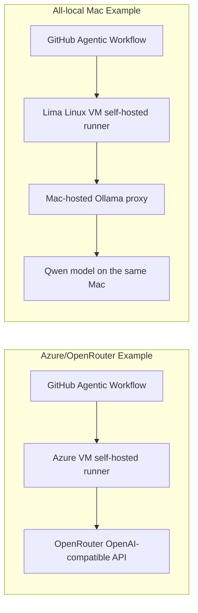

# Agentic Workflows with self-hosted runners and local inference

This repository demonstrates how [GitHub Agentic Workflows](https://github.github.com/gh-aw/) can be used with: 

- self-hosted runners
- model-routing platforms
- local inference

You can even run your Actions jobs, including AI models, directly on your laptop or Mac Mini.

We provide the following example scenarios:

- [Azure VM self-hosted runner with OpenRouter](infra/azure-vm/README.md)
- [Local Mac self-hosted runner with Lima, Ollama, and Qwen](infra/local-macrunner-qwenollama/README.md)


## Why self-host?

Self-hosting runners gives you extra control over your Actions execution environment, and your choice of hosting platform. Choosing a model-routing platform like Open Router can give you access to additional models, and hosting your inference yourself can help control costs. Frontier models still require datacenter-scale resources to host, but there are models small enough to run on a MacBook Air that can still perform useful work. 



## Repository Map

- `.github/workflows/azure-vm-openrouter.md` - agentic workflow source for the Azure VM runner and OpenRouter lane.
- `.github/workflows/local-macrunner-qwenollama.md` - agentic workflow source for the all-local Mac runner and Qwen/Ollama lane.
- `.github/workflows/cloudflare-runner-openrouter.md` - agentic workflow source for a Cloudflare-labeled Linux runner lane.
- `.github/workflows/*lock.yml` - generated executable GitHub Actions workflows produced by `gh aw compile`.
- `.github/workflows/azure-runner-capability-smoke.yml` - deterministic Azure runner capability and OpenRouter smoke workflow.
- `.github/workflows/macos-qwen-local-model-smoke.yml` - deterministic Qwen/Ollama smoke workflow for a macOS local model endpoint.
- `scripts/check-gh-aw-runner.sh` - validates Linux runner requirements for `gh-aw`.
- `scripts/smoke-openrouter.sh` - minimal OpenRouter chat-completions request.
- `scripts/smoke-local-openai-compatible.sh` - minimal local OpenAI-compatible chat-completions request.
- `scripts/check-qwen-only-models.sh` - fails if blocked local model-family identifiers appear in the repo.
- `scripts/run-local-macrunner-qwenollama.sh` - all-in-one launcher for the local Mac/Lima/Ollama/Qwen agentic lane.
- `infra/azure-vm/` - Azure VM runner bootstrap, cloud-init template, configuration, and scenario guide.
- `infra/local-macrunner-qwenollama/` - all-local Mac plus Lima runner bootstrap and scenario guide.
- `infra/macos/` - generic macOS runner and Qwen/Ollama setup helpers.
- `infra/cloudflare/` - notes for a Cloudflare-labeled runner lane.

## Prerequisites

Install the GitHub CLI and the Agentic Workflows extension:

```bash
gh auth login
gh extension install github/gh-aw
```

Compile the Markdown workflow sources into GitHub Actions lock files:

```bash
gh aw compile --validate --actionlint
scripts/patch-local-qwen-awf-pricing.sh
```

The generated `.lock.yml` files are committed because GitHub Actions runs those files, not the Markdown workflow sources.

## Scenario 1: Azure VM Runner, OpenRouter Inference

Use this lane when you want the agent job to run on a Linux VM you operate, while model calls go through OpenRouter.

Read the full guide:

```bash
open infra/azure-vm/README.md
```

Short version:

```bash
gh aw secrets set OPENROUTER_API_KEY --value "$OPENROUTER_API_KEY"
infra/azure-vm/create-runner-vm.sh
gh workflow run azure-runner-capability-smoke.yml
gh aw run azure-vm-openrouter
```

Runner labels:

```text
self-hosted,linux,x64,azure,gh-aw
```

## Scenario 2: Local Mac Runner, Local Qwen/Ollama Inference

Use this lane when you want the whole demonstrator on one Mac: GitHub Actions runner host, Linux agent runtime, and local model endpoint.

Read the full guide:

```bash
open infra/local-macrunner-qwenollama/README.md
```

Short version:

```bash
scripts/run-local-macrunner-qwenollama.sh "Check the local agent lane."
```

The launcher starts or verifies Ollama on macOS, creates Qwen model aliases, boots an x86_64 Lima Linux VM, registers that VM as the GitHub Actions self-hosted runner, dispatches the workflow, and watches it.

Runner labels:

```text
self-hosted,linux,x64,local-macrunner-qwenollama,gh-aw
```

Model defaults:

```text
Ollama source model: qwen2.5:0.5b
Workflow model alias: qwen2.5-0.5b
OpenCode model: openai/qwen2.5-0.5b
```

## Runner Requirements

`gh-aw` self-hosted runners must be Linux hosts with:

- Docker.
- Passwordless sudo for the runner service account.
- iptables support.
- Outbound HTTPS access to GitHub, GHCR, and the selected engine endpoint.
- Access to any domains listed in the workflow network allowlist.

A macOS host cannot directly satisfy the Linux runner requirements for the `gh-aw` agent job, which is why the all-local Mac scenario uses Lima to run a local Linux VM. The Mac still owns the local model endpoint.

## Running The Demos

Deterministic smoke workflows:

```bash
gh workflow run azure-runner-capability-smoke.yml
gh workflow run cloudflare-runner-capability-smoke.yml
gh workflow run macos-local-model-smoke.yml
gh workflow run macos-qwen-local-model-smoke.yml
```

Agentic workflows:

```bash
gh aw run azure-vm-openrouter
scripts/run-local-macrunner-qwenollama.sh
gh aw run cloudflare-runner-openrouter
```

Inspect runs:

```bash
gh run list --limit 10
gh run view RUN_ID --log
gh aw audit RUN_ID
```

## Adapting The Pattern

Use the included scenarios as starting points:

- Change the runner labels to point at another host class.
- Change the bootstrap scripts to install your internal dependencies.
- Change `OPENAI_BASE_URL` and the engine config to point at another OpenAI-compatible gateway.
- Change the model IDs and smoke tests to match your local inference service.
- Add private network routes, mounted caches, GPUs, or internal tools to the self-hosted runner.

The useful idea is not "Azure" or "Lima" specifically. The useful idea is that agentic workflows can run wherever your runner can run, and they can call whichever model endpoint you deliberately expose to that runner.
