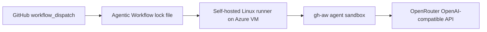

# Azure VM self-hosted runner with OpenRouter

This scenario provisions an Ubuntu VM in Azure, registers it as a GitHub Actions self-hosted runner, and runs a GitHub Agentic Workflow on that runner while routing inference through OpenRouter.

It is an example architecture, not a prescription. You can replace Azure with another VM provider, replace OpenRouter with another OpenAI-compatible gateway, or extend the VM bootstrap to install private tools and network routes. The important pattern is:



## When To Use This Lane

Use the Azure/OpenRouter lane when you want:

- A Linux runner you control.
- Cloud-hosted compute with Docker, sudo, and iptables available to `gh-aw`.
- A simple OpenAI-compatible inference endpoint without running a model server yourself.
- A reference implementation that can later be moved to another cloud, private network, or internal model gateway.

The runnable workflow source is `.github/workflows/azure-vm-openrouter.md`. The compiled executable workflow is `.github/workflows/azure-vm-openrouter.lock.yml`.

## Runtime Shape

The lane uses these runner labels:

```text
self-hosted,linux,x64,azure,gh-aw
```

The workflow config routes inference through OpenRouter:

```yaml
engine:
  id: codex
  model: openai/gpt-4o-mini
  env:
    OPENAI_BASE_URL: "https://openrouter.ai/api/v1"
    OPENAI_API_KEY: ${{ secrets.OPENROUTER_API_KEY }}
```

The runner setup script renders `cloud-init.template.yaml`, creates the VM, installs Docker and runner prerequisites, registers the VM with GitHub, and starts the runner as a service.

## Prerequisites

On the machine that provisions the VM:

- `gh` installed and authenticated to the target GitHub repository.
- `gh-aw` installed with `gh extension install github/gh-aw`.
- `az` installed and authenticated to an Azure subscription that can create resource groups, virtual machines, networking, public IPs, and disks.
- An OpenRouter API key.

Confirm GitHub and Azure access:

```bash
gh auth status
gh repo view --json nameWithOwner --jq .nameWithOwner
az account show --query '{name:name,id:id,tenantId:tenantId,user:user.name}' -o table
```

Set the OpenRouter key as a repository secret:

```bash
gh aw secrets set OPENROUTER_API_KEY --value "$OPENROUTER_API_KEY"
```

Optional repository variables for smoke-test metadata:

```bash
gh variable set OPENROUTER_MODEL --body "openai/gpt-4o-mini"
gh variable set OPENROUTER_SITE_URL --body "https://github.com/OWNER/REPO"
gh variable set OPENROUTER_APP_NAME --body "gh-aw-self-hosted-demo"
```

## Configuration

Runner settings live in `infra/azure-vm/runner.conf`. The committed default is the known-good demonstrator shape:

```text
location: westus2
size: Standard_D2s_v5
placement: regional
resource group: gh-aw-demo-runners
runner name: gh-aw-azure-runner-01
```

The config file uses shell default assignments. That means environment variables, GitHub Actions `env`, or matrix values can override the defaults without editing the committed file:

```bash
AZURE_LOCATION=westus2 \
AZURE_VM_SIZE=Standard_D2s_v5 \
infra/azure-vm/create-runner-vm.sh
```

For local experiments, prefer a gitignored override file:

```bash
cp infra/azure-vm/runner.conf infra/azure-vm/runner.local.conf
AZURE_RUNNER_CONFIG=infra/azure-vm/runner.local.conf infra/azure-vm/create-runner-vm.sh
```

The helper tries the preferred location and size first, then walks fallback locations, VM sizes, and optional availability zones when Azure reports capacity or SKU restrictions.

## Create The Runner VM

From the repository root:

```bash
infra/azure-vm/create-runner-vm.sh
```

What the helper does:

- Selects `AZURE_SUBSCRIPTION_ID` when configured.
- Creates or reuses `AZURE_RESOURCE_GROUP`.
- Requests a short-lived GitHub runner registration token with `gh api`.
- Renders cloud-init with the repository, runner token, runner name, and runner version.
- Attempts VM creation across the configured location, size, and zone candidates.
- Installs the runner and starts it as a service.
- Labels the runner for the Azure lane.

When creation succeeds, check the runner in GitHub:

```bash
gh api repos/$(gh repo view --json nameWithOwner --jq .nameWithOwner)/actions/runners \
  --jq '.runners[] | select([.labels[].name] | index("azure")) | {name,status,busy,labels:[.labels[].name]}'
```

## Validate The Runner

Run the deterministic smoke workflow first:

```bash
gh workflow run azure-runner-capability-smoke.yml
gh run watch
```

That smoke test confirms the runner has the capabilities `gh-aw` needs and that OpenRouter can answer a minimal chat-completions request.

## Run The Agentic Workflow

Dispatch the agentic lane:

```bash
gh aw run azure-vm-openrouter
```

Or include an explicit prompt:

```bash
gh aw run azure-vm-openrouter -F prompt="Verify the Azure self-hosted runner lane."
```

Inspect the run:

```bash
gh run list --workflow azure-vm-openrouter.lock.yml --limit 5
gh run view RUN_ID --log
gh aw audit RUN_ID
```

The agent should confirm:

- It is running on a self-hosted Linux runner with the Azure lane labels.
- Docker, sudo, iptables, GitHub access, and network egress are available.
- The engine is configured with `OPENAI_BASE_URL=https://openrouter.ai/api/v1`.
- The lane is ready for agentic workloads.

## Running Provisioning From GitHub Actions

The provisioning helper is intentionally config-file driven so it can run locally or from another automation lane. To run it from GitHub Actions, the job needs:

- Azure authentication before invoking the script.
- A GitHub token that can create self-hosted runner registration tokens for the repository.
- The same `AZURE_*` values supplied through workflow `env`, variables, or a checked-in config file.

After the VM runner exists, the agentic workflow itself can run on that VM.

## Customize The Lane

Common adaptations:

- Change `AZURE_VM_SIZE` for larger workspaces, heavier tools, or more parallelism.
- Change `AZURE_LOCATION` and fallback lists for your subscription capacity.
- Add packages, credentials, network routes, caches, or internal tools to `cloud-init.template.yaml`.
- Change the workflow runner labels if this VM should represent a different lane.
- Change `OPENAI_BASE_URL`, model, and smoke-test script when using a different OpenAI-compatible inference gateway.

The Azure VM is just one way to host a self-hosted runner. The same workflow pattern works with any Linux host that satisfies the runner requirements and is registered with matching labels.

## Troubleshooting

`AuthorizationFailed` from Azure:

The selected Azure account or subscription cannot create the requested resource. Confirm `az account show`, switch subscriptions with `az account set --subscription SUBSCRIPTION_ID`, or use a subscription where your account can create resource groups and VMs.

`SkuNotAvailable` or capacity errors:

The helper will try configured fallbacks. Update `AZURE_LOCATION`, `AZURE_VM_SIZE`, `AZURE_FALLBACK_LOCATIONS`, `AZURE_FALLBACK_VM_SIZES`, or set `AZURE_USE_ZONES=0` for regional placement.

`InvalidResourceLocation` for existing network resources:

Azure found existing resources with the same generated names in a different location. Reuse the existing VM location, change `AZURE_VM_NAME`, or delete the old resource group before recreating.

Runner does not pick up the job:

Check that the runner is online and has all required labels:

```bash
gh api repos/$(gh repo view --json nameWithOwner --jq .nameWithOwner)/actions/runners \
  --jq '.runners[] | {name,status,busy,labels:[.labels[].name]}'
```

OpenRouter smoke fails:

Confirm the repository secret exists and that the runner can reach OpenRouter:

```bash
gh secret list | grep OPENROUTER_API_KEY
gh workflow run azure-runner-capability-smoke.yml
```

## Clean Up

Delete the Azure resource group when you are done:

```bash
. infra/azure-vm/runner.conf
az group delete --name "$AZURE_RESOURCE_GROUP"
```

Remove any stale offline runner registration from GitHub repository settings if Azure deletion happened before the runner service deregistered.
