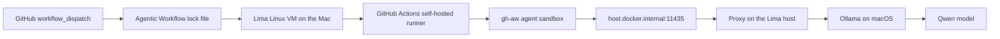

# Local Mac self-hosted runner with Lima, Ollama, and Qwen

This scenario runs the whole demonstrator on one Mac:

- The Mac hosts Ollama and the local Qwen model.
- A local x86_64 Lima Linux VM runs the GitHub Actions self-hosted runner.
- The GitHub Agentic Workflow runs on that Linux runner.
- OpenCode is the agent harness.
- OpenCode calls the Mac-hosted Qwen/Ollama endpoint through an OpenAI-compatible API.

It is an example architecture, not a boundary. You can replace Lima with any Linux host, replace Ollama with another OpenAI-compatible local inference service, or point the runner at a model server elsewhere on your network. The useful pattern is that the runner and inference endpoint are both under your control.



## Why Lima Is In The Loop

`gh-aw` agent jobs need a Linux runner with Docker, passwordless sudo, and iptables. A Mac can host the model endpoint, but the agent job itself needs Linux runtime capabilities. Lima gives the Mac a local Linux VM that can register as a normal GitHub Actions self-hosted runner.

That makes the scenario all-local while still satisfying the `gh-aw` runner requirements:

```text
macOS host: Ollama, Qwen model, Lima VM manager
Lima Linux VM: GitHub Actions runner, Docker, sudo, iptables, gh-aw job
Agent container: OpenCode calling the local model endpoint
```

## When To Use This Lane

Use this lane when you want:

- A fully local proof of agentic workflows on self-hosted infrastructure.
- Local inference through Ollama instead of a remote model API.
- A small, cheap model for testing the plumbing.
- A reproducible pattern you can move to a larger local workstation, lab machine, private Linux host, GPU box, or internal inference gateway.

The runnable workflow source is `.github/workflows/local-macrunner-qwenollama.md`. The compiled executable workflow is `.github/workflows/local-macrunner-qwenollama.lock.yml`.

## Runtime Shape

The runner labels are:

```text
self-hosted,linux,x64,local-macrunner-qwenollama,gh-aw
```

The default model identifiers are:

```text
Ollama source model: qwen2.5:0.5b
Workflow model alias: qwen2.5-0.5b
OpenCode model: openai/qwen2.5-0.5b
```

The aliases exist because each layer has slightly different model ID expectations:

- Ollama source model uses the normal Ollama tag form: `qwen2.5:0.5b`.
- The workflow-safe wire alias avoids the `:` tag character: `qwen2.5-0.5b`.
- OpenCode uses provider-qualified model IDs: `openai/qwen2.5-0.5b`.

The agent container calls:

```text
http://host.docker.internal:11435/v1
```

The Linux runner host proxies that address to the Mac-hosted Ollama endpoint.

## Prerequisites

On the Mac:

- `gh` installed and authenticated to the target GitHub repository.
- `gh-aw` installed with `gh extension install github/gh-aw`.
- Homebrew.
- Enough disk for Lima, Docker images, the GitHub Actions runner, and the Qwen model.
- Network access from the Mac to GitHub and from the Lima VM back to the Mac.

The launcher can install or verify Lima and Ollama. Confirm the basics:

```bash
gh auth status
gh repo view --json nameWithOwner --jq .nameWithOwner
```

## One-command All-local Setup And Run

From the repository root on the Mac:

```bash
scripts/run-local-macrunner-qwenollama.sh "Check the local agent lane."
```

The launcher does the whole flow:

- Starts or verifies Ollama on the Mac.
- Pulls or verifies the tiny Qwen model.
- Creates the workflow and OpenCode model aliases.
- Creates or starts a local x86_64 Lima Linux VM named `gh-aw-local-qwen`.
- Syncs the repository snapshot into the Lima VM.
- Installs Linux runner prerequisites inside the VM.
- Registers the VM as a GitHub Actions self-hosted runner.
- Starts the runner service.
- Waits until GitHub reports the runner online and idle.
- Dispatches the agentic workflow.
- Watches the run by default.

This is the easiest path because it proves the Mac host, local model endpoint, Linux runner, GitHub registration, workflow dispatch, OpenCode harness, and safe-output conclusion in one command.

## Useful Launcher Overrides

Run without watching:

```bash
WATCH=0 scripts/run-local-macrunner-qwenollama.sh
```

Target a branch:

```bash
REF=main scripts/run-local-macrunner-qwenollama.sh
```

Only print what would run:

```bash
DRY_RUN=1 scripts/run-local-macrunner-qwenollama.sh
```

Dispatch without setting up the runner:

```bash
SETUP_RUNNER=0 scripts/run-local-macrunner-qwenollama.sh
```

Use a different Lima VM name:

```bash
LIMA_INSTANCE=my-gh-aw-runner scripts/run-local-macrunner-qwenollama.sh
```

Use another Qwen model while preserving the same pattern:

```bash
LOCAL_AGENT_MODEL=qwen2.5:0.5b \
LOCAL_AGENT_MODEL_ALIAS=qwen2.5-0.5b \
LOCAL_AGENT_OPENCODE_MODEL=openai/qwen2.5-0.5b \
scripts/run-local-macrunner-qwenollama.sh
```

## Mac Endpoint Only

If you only want to prepare the local model endpoint on macOS:

```bash
infra/local-macrunner-qwenollama/setup-tiny-qwen-agent.sh
```

By default, the endpoint stays bound to localhost. If a Linux runner must reach this Mac over the network, expose Ollama deliberately:

```bash
EXPOSE_OLLAMA_TO_NETWORK=1 \
infra/local-macrunner-qwenollama/setup-tiny-qwen-agent.sh
```

The helper delegates to `infra/macos/setup-local-qwen-ollama.sh` on macOS. It installs or verifies Ollama, starts the service, pulls the Qwen model when needed, creates aliases, and runs a local OpenAI-compatible smoke test.

## Linux Runner Side

The launcher normally runs this inside the Lima VM for you. If you want a separate Linux host to be the runner while the Mac hosts the model, run this from the Linux host:

```bash
GITHUB_REPOSITORY=githubnext/self-hosted-aw \
OLLAMA_UPSTREAM_BASE_URL=http://MAC_HOST_OR_IP:11434/v1 \
infra/local-macrunner-qwenollama/setup-tiny-qwen-agent.sh
```

The Linux setup:

- Installs Docker, `socat`, `iptables`, `sudo`, `git`, `gh`, Node.js, npm, Python, and runner support packages on apt-based Linux.
- Creates an `actions` service account with passwordless sudo.
- Registers a GitHub Actions runner.
- Labels the runner `local-macrunner-qwenollama,gh-aw`.
- Sets repository variables for the local agent endpoint and Qwen model alias when enabled.
- Starts a `socat` proxy on `0.0.0.0:11435`.
- Adds `host.docker.internal` on the Linux host, mapped to Docker's bridge gateway, so both workflow steps and the chrooted `gh-aw` agent container can reach the proxy.

Useful Linux setup overrides:

```bash
SET_GITHUB_VARIABLES=0 infra/local-macrunner-qwenollama/setup-linux-runner.sh
INSTALL_PACKAGES=0 infra/local-macrunner-qwenollama/setup-linux-runner.sh
INSTALL_RUNNER_SERVICE=0 infra/local-macrunner-qwenollama/setup-linux-runner.sh
RUNNER_NAME=my-local-agent-runner infra/local-macrunner-qwenollama/setup-linux-runner.sh
RUNNER_DIR=/opt/actions-runner-local-agent infra/local-macrunner-qwenollama/setup-linux-runner.sh
```

## Run The Workflow Manually

After the runner is already online:

```bash
gh aw run local-macrunner-qwenollama
```

Or dispatch the compiled workflow directly:

```bash
gh workflow run local-macrunner-qwenollama.lock.yml \
  -f prompt="Verify the all-local Mac OpenCode Qwen lane."
```

Inspect the run:

```bash
gh run list --workflow local-macrunner-qwenollama.lock.yml --limit 5
gh run view RUN_ID --log
gh aw audit RUN_ID
```

Expected proof points in a healthy run:

- `Smoke test local Qwen/Ollama endpoint` succeeds with HTTP 200.
- `Install OpenCode CLI` succeeds.
- `Write OpenCode Config` succeeds.
- `Execute OpenCode CLI` succeeds.
- `safe_outputs` and `conclusion` complete successfully.

## Why There Is A Post-compile Patch

The local lane uses `scripts/patch-local-qwen-awf-pricing.sh` after `gh aw compile`.

That patch keeps the generated lock workflow aligned with the local OpenAI-compatible endpoint:

- Disables AWF token steering and the API proxy for this lane.
- Routes OpenCode directly to `http://host.docker.internal:11435/v1`.
- Allows the local host port required by the proxy.
- Excludes `OPENAI_API_KEY` from the agent container environment while still satisfying generation-time validation.

Run it after compiling:

```bash
gh aw compile local-macrunner-qwenollama --validate --approve
scripts/patch-local-qwen-awf-pricing.sh
```

## Customize The Lane

Common adaptations:

- Run the Linux runner on a different Linux host instead of Lima.
- Run Ollama on a larger Mac, workstation, or internal model server.
- Replace Ollama with another OpenAI-compatible local inference service.
- Use a larger Qwen model by changing `LOCAL_AGENT_MODEL`, `LOCAL_AGENT_MODEL_ALIAS`, and `LOCAL_AGENT_OPENCODE_MODEL`.
- Add private tools, local files, mounted caches, or network routes to the Linux runner.
- Change the workflow labels to create multiple local lanes for different machines or model sizes.

Keep the same core contract: the `gh-aw` job runs on a Linux runner with the right labels, and the agent harness gets an OpenAI-compatible endpoint it can reach.

## Troubleshooting

Runner stays queued:

Check that the runner is online, idle, and has every required label:

```bash
gh api repos/$(gh repo view --json nameWithOwner --jq .nameWithOwner)/actions/runners \
  --jq '.runners[] | {name,status,busy,labels:[.labels[].name]}'
```

The workflow cannot reach `host.docker.internal:11435`:

Confirm the Linux-side proxy is running and reachable:

```bash
limactl shell gh-aw-local-qwen -- curl -fsS http://host.docker.internal:11435/v1/models
```

If the smoke test succeeds but `Execute OpenCode CLI` reports `ConnectionRefused` for `http://host.docker.internal:11435/v1/chat/completions`, refresh the Linux-side host alias:

```bash
limactl shell gh-aw-local-qwen -- bash -lc 'bridge_ip="$(docker network inspect bridge --format "{{range .IPAM.Config}}{{if .Gateway}}{{.Gateway}}{{end}}{{end}}" | sed -n "1p")" && sudo sed -i.bak "/[[:space:]]host\\.docker\\.internal\\([[:space:]]\\|$\\)/d" /etc/hosts && printf "%s host.docker.internal\n" "$bridge_ip" | sudo tee -a /etc/hosts'
```

The Mac endpoint is not reachable from Lima:

Confirm Ollama is running on the Mac and exposed for the VM:

```bash
EXPOSE_OLLAMA_TO_NETWORK=1 infra/local-macrunner-qwenollama/setup-tiny-qwen-agent.sh
limactl shell gh-aw-local-qwen -- curl -fsS http://host.lima.internal:11434/v1/models
```

OpenCode cannot find the model:

Confirm the aliases exist in Ollama:

```bash
ollama list
```

Then rerun the Mac setup helper, which recreates aliases when needed:

```bash
infra/local-macrunner-qwenollama/setup-tiny-qwen-agent.sh
```

Runner setup asks for packages repeatedly:

The Linux VM is apt-based and the script is idempotent. Re-running is expected to be safe. Use `INSTALL_PACKAGES=0` only when you know the host already has the required packages.

## Clean Up

Stop the Lima VM:

```bash
limactl stop gh-aw-local-qwen
```

Delete the Lima VM:

```bash
limactl delete gh-aw-local-qwen
```

Remove any stale offline runner registration from GitHub repository settings if the VM was deleted before the runner deregistered.

Stop Ollama on macOS if you do not want the model service running:

```bash
brew services stop ollama
```
